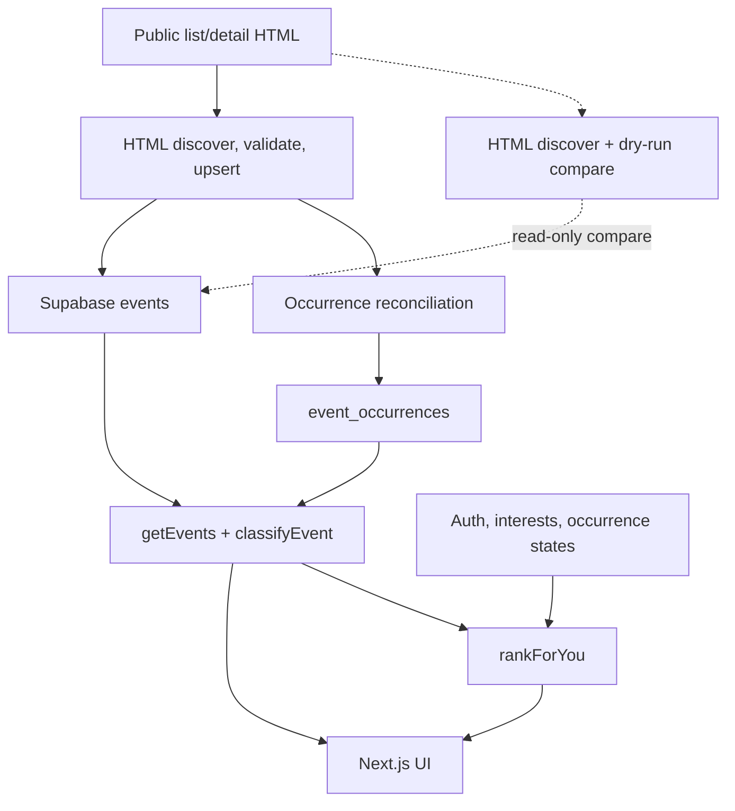

# CampusRadar

Personalized career-event discovery for University of Illinois Urbana-Champaign (UIUC) students.

## What it is

Career events at UIUC are spread across department and college calendars. Students otherwise have to check those sources separately and decide what is worth attending.

CampusRadar collects Illinois Webtools calendars into one store, classifies career relevance with explicit text rules, groups the same happening when it appears on more than one calendar, and shows upcoming events in a Next.js browser. Signed-in students can save career interests, get a deterministic For You ranking, mark occurrences Interested, Going, or Not Interested, add an event to Google Calendar, and receive a personalized email digest.

It does not use a machine-learning recommender.

## Current capabilities

**V1**

- Public homepage of upcoming and ongoing Illinois Webtools events (Career & Industry, All Events, title search, next 7 or 30 days)
- Rule-based career relevance, with short explanations on Career & Industry cards
- Seven collected calendars: Siebel (2654), HireIllini Career Fairs (1551), Research Park (5115), LAS Career Services (6499), ECE Student Events (6805), AE Corporate Relations (7541), Illinois Entrepreneurship Master (6327)
- Production collection via public HTML list/detail pages, upserted on `(source, external_id)`
- Stable occurrence grouping so one happening is one card even when multiple source rows exist
- Email/password accounts, confirmation, password recovery, session cookies, and an account page
- Controlled career-interest catalog (students pick from that list only)
- Interested / Going / Not Interested on each occurrence for signed-in users
- For You ranking from saved interests (signed-in users only)
- Add to Google Calendar links on event cards
- Personalized email digest (Resend) with duplicate-send protection
- Authenticated Vercel Cron for daily Webtools collection and the digest

Collection discovers today through 180 days ahead in America/Chicago, using windows of at most 30 days and splitting 100-row lists to avoid truncation. Ambiguous schedules are skipped; failed list discovery or a blocked identity/data-quality comparison prevents upserts. Missing events are never deleted. Isolated detail failures produce a warning with exit 0; collection/integrity failures exit 1.

## Architecture



The website reads events with the publishable (anon) Supabase key. Collection and occurrence writes use the secret key in CLI scripts and the authenticated server-side cron route only. HTML discovery is allowed to request `https://calendars.illinois.edu/list/{id}` and `/detail/{calendarId}/{eventId}` only.

## Event identity model

| Layer | What it is | Stable key |
| --- | --- | --- |
| Raw / source event | One distinct source/external-ID row | `(source, external_id)` — Illinois Webtools uses `{eventId}@illinois.edu`, with existing ICS recurrence-qualified `{uid}::{recurrenceId}` rows left unchanged |
| Occurrence | One happening shown as one card | `event_occurrences.id`, with each raw row mapped exactly once |
| User state | That student's plan for the happening | `(user_id, occurrence_id)` → `interested`, `going`, or `not_interested` |

The same Webtools event ID can appear on more than one calendar or date window. Collection fetches its detail page once and upserts one raw row. Existing stored source URLs and nonempty enrichment survive sparse HTML; HTML registration URLs can enrich stored rows. Sponsor is not mapped to company. Distinct external IDs remain separate raw rows with their provenance (source URL, registration, description). Reconciliation groups rows that share a start time plus a canonical URL, or the same normalized non-generic title, end time, and compatible location. Established occurrence identities are never automatically merged or split. User marks attach to the occurrence so they survive extra source rows and field updates.

## Personalization

Career interests are a fixed catalog (Software Engineering, Systems / Infrastructure, AI / Machine Learning, Data / Analytics, Cybersecurity, Hardware / Embedded, Product, Fintech, Startups / Entrepreneurship, Research, Consulting). Only those slugs can be saved.

For You is a deterministic ranker: phrase matches on titles (and, for already career-relevant events, stronger body/category/company phrases), plus a small career-relevance bonus. Interest matches sort first. Interested and Going are stored on the card and are not ranking inputs. Occurrences marked Not Interested are excluded from For You. Events classified `not_relevant` are also dropped. The homepage shows at most 30 results.

Anonymous visitors can browse Career & Industry and All Events. For You and occurrence controls require a signed-in session.

## Tech stack

- Next.js 16 (App Router, webpack production build), React 19, TypeScript, Tailwind CSS 4
- Vitest, ESLint
- Supabase Postgres, Auth, and Row Level Security
- `@supabase/supabase-js` and `@supabase/ssr`
- Node CLI collection via `tsx`

## Development / local setup

Prerequisites: Node.js compatible with the installed Next.js release and supporting `--env-file`, plus npm. The repository does not pin a Node.js version.

1. Install dependencies: `npm install`
2. Copy `.env.example` to `.env.local` (never commit `.env.local`)
3. Set:

   ```bash
   SUPABASE_URL=
   SUPABASE_PUBLISHABLE_KEY=
   SUPABASE_SECRET_KEY=
   CRON_SECRET=
   SITE_URL=
   RESEND_API_KEY=
   RESEND_FROM=
   ```

   The first two are required for the website and the read-only HTML dry run. `SUPABASE_SECRET_KEY` is used by CLI collection, occurrence reconciliation, occurrence verification, and the authenticated cron routes. `CRON_SECRET` authenticates those routes. `SITE_URL`, `RESEND_API_KEY`, and `RESEND_FROM` are required for the digest. Do not prefix any of these with `NEXT_PUBLIC_`.
4. Apply the SQL files in `supabase/migrations/` to the project, in numeric order. Comments in those files describe RLS and grants.
5. Run the app: `npm run dev` and open `http://localhost:3000`

Optional collection (writes events, then reconciles occurrences):

```bash
npm run collect:webtools
# or one calendar:
npm run collect:siebel
```

Read-only HTML dry run (publishable key, no database writes; replaces the local `audits/webtools-html-dry-run.json` report):

```bash
npx tsx --env-file=.env.local scripts/dry-run-webtools-html.ts
```

Occurrence helpers: `npm run reconcile:occurrences`, `npm run verify:occurrences`. Local digest send: `npm run digest`.

## Testing / verification

```bash
npm test
npx tsc --noEmit
npm run lint
npm run build
```

`npm run build` uses webpack (`next build --webpack`).

## Current status

Production collection uses public HTML list/detail pages across seven Webtools calendars (Siebel, HireIllini Career Fairs, Research Park, LAS Career Services, ECE Student Events, AE Corporate Relations, Illinois Entrepreneurship Master). ICS parsers and fixtures remain for compatibility tests; automated production collection no longer fetches ICS.

See [docs/engineering-log.md](docs/engineering-log.md) for the live cutover verification and the decisions behind the system.
